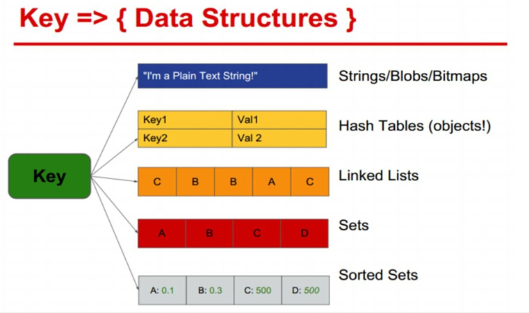

#**Redis Key（键）操作**
>*Web程序猿博客：[http://blog.csdn.net/thinkercode](http://blog.csdn.net/thinkercode)*

####**Key（键）**
　　可以用任何二进制序列作为key值，从形如“foo”的简单字符串到一个JPEG文件的内容都可以。空字符串也是有效的key值。

####**关于key的几条规则**
可用任何二进制序列作为key值。
不用太长的键值。不仅消耗内存，而且在数据查找中计算成本很高。
太短的键值通常也不是好主意，通常遵循一种模式、简单易读的字串作为key值。
Key：一个字符串
Value：string、hash、list、set、sorted set等数据结构存储数据。


####**key 相关命令**

1. KEYS<br/>
	KEYS pattern<br/>
	查找所有符合给定模式 pattern 的 key 。<br/>
	KEYS * 匹配数据库中所有 key 。
	KEYS h?llo 匹配 hello ，hallo 和 hxllo 等。
	KEYS h*llo 匹配 hllo 和 heeeeello 等。
	KEYS h[ae]llo 匹配 hello 和 hallo ，但不匹配 hillo 。
	特殊符号用 \隔开<br/>
	时间复杂度： O(N)，N 为数据库中 key 的数量。
	返回值： 符合给定模式的 key 列表。
	```shell
	127.0.0.1:6379[15]>  MSET one 1 two 2 three 3 four 4
	OK
	127.0.0.1:6379[15]>  KEYS *o*
	1) "four"
	2) "one"
	3) "two"
	127.0.0.1:6379[15]> KEYS t??
	1) "two"
	127.0.0.1:6379[15]>  KEYS t[w]*
	1) "two"
	127.0.0.1:6379[15]> KEYS *
	1) "four"
	2) "three"
	3) "one"
	4) "two"
	```
	><font color=orange>Warning: KEYS 的速度非常快，但在一个大的数据库中使用它仍然可能造成性能问题，如果你需要从一个数据集中查找特定的 key ，你最好还是用 Redis 的集合结构 (set) 来代替。</font>

2. EXISTS<br/>
	EXISTS key<br/>
	检查给定 key 是否存在。
	返回值： 若 key 存在，返回 1 ，否则返回 0 。<br/>
	```shell
	127.0.0.1:6379[15]> SET db "redis"
	OK
	127.0.0.1:6379[15]> EXISTS db
	(integer) 1
	127.0.0.1:6379[15]> DEL db
	(integer) 1
	127.0.0.1:6379[15]> EXISTS db
	(integer) 0
	```

3. DEL<br/>
	DEL key [key ...]<br/>
	删除给定的一个或多个 key 。
	不存在的 key 会被忽略。
	时间复杂度：O(N)，N 为被删除的 key 的数量。
	删除单个字符串类型的 key ，时间复杂度为 O(1)。删除单个列表、集合、有序集合或哈希表类型的 key ，时间复杂度为 O(M)，M 为以上数据结构内的元素数量。
	返回值： 被删除 key 的数量。<br/>
	```shell
	127.0.0.1:6379[15]> SET key_1 1
	OK
	127.0.0.1:6379[15]> DEL key_1
	(integer) 1
	127.0.0.1:6379[15]> EXISTS key_1
	(integer) 0
	127.0.0.1:6379[15]> DEL key_1
	(integer) 0
	127.0.0.1:6379[15]> SET key_2 2
	OK
	127.0.0.1:6379[15]> SET key_3 3
	OK
	127.0.0.1:6379[15]> DEL key_2 key_3 key_1
	(integer) 2
	```
	
4. EXPIRE<br/>
	EXPIRE key seconds<br/>
	为给定 key 设置生存时间，当 key 过期时 (生存时间为 0 )，它会被自动删除。
	在 Redis 中，带有生存时间的 key 被称为『易失的』(volatile)。
	生存时间可以通过使用DEL 命令来删除整个 key 来移除，或者被SET 和GETSET 命令覆写 (overwrite)，这意味着，如果一个命令只是修改 (alter) 一个带生存时间的 key 的值而不是用一个新的 key 值来代替(replace) 它的话，那么生存时间不会被改变。
	比如说，对一个 key 执行INCR 命令，对一个列表进行LPUSH 命令，或者对一个哈希表执行HSET 命令，这类操作都不会修改 key 本身的生存时间。
	另一方面，如果使用RENAME 对一个 key 进行改名，那么改名后的 key 的生存时间和改名前一样。RENAME 命令的另一种可能是，尝试将一个带生存时间的 key 改名成另一个带生存时间的 another_key，这时旧的 another_key (以及它的生存时间) 会被删除，然后旧的 key 会改名为 another_key ，因此，新的 another_key 的生存时间也和原本的 key 一样。
	使用PERSIST 命令可以在不删除 key 的情况下，移除 key 的生存时间，让 key 重新成为一个『持久的』(persistent) key 。
	更新生存时间，可以对一个已经带有生存时间的 key 执行EXPIRE 命令，新指定的生存时间会取代旧的生存时间。
	时间复杂度： O(1)
	返回值：设置成功返回 1 。
	当 key 不存在或者不能为 key 设置生存时间时 (比如在低于 2.1.3 版本的 Redis 中你尝试更新 key 的生存时间)，返回 0 。<br/>
	```shell
	127.0.0.1:6379[15]> SET key_1 1
	OK
	127.0.0.1:6379[15]> EXPIRE key_1 30
	(integer) 1
	127.0.0.1:6379[15]> TTL key_1
	(integer) 24
	127.0.0.1:6379[15]> EXPIRE key_1 300
	(integer) 1
	127.0.0.1:6379[15]> TTL key_1
	(integer) 296
	```	
	
5. EXPIREAT<br/>
	EXPIREAT key timestamp<br/>
	EXPIREAT 的作用和EXPIRE 类似，都用于为 key 设置生存时间。
	不同在于EXPIREAT 命令接受的时间参数是 UNIX 时间戳 (unix timestamp)。
	时间复杂度： O(1)
	返回值：
	　　如果生存时间设置成功，返回 1 。
	　　当 key 不存在或没办法设置生存时间，返回 0 。<br/>
	```shell
	127.0.0.1:6379[15]> SET key_1 1
	OK
	127.0.0.1:6379[15]> EXPIREAT key_1 1434360999
	(integer) 1
	127.0.0.1:6379[15]> TTL key_1
	(integer) 10190
	```	
	
6. PEXPIRE<br/>
	PEXPIRE key milliseconds<br/>
	这个命令和EXPIRE 命令的作用类似，但是它以毫秒为单位设置 key 的生存时间，而不像EXPIRE 命令那样，以秒为单位。
	时间复杂度： O(1)
	返回值：
	　　设置成功，返回 1
	　　key 不存在或设置失败，返回 0<br/>
	```shell
	127.0.0.1:6379[15]> SET key_1 1
	OK
	127.0.0.1:6379[15]> PEXPIRE key_1 10000
	(integer) 1
	127.0.0.1:6379[15]> TTL key_1
	(integer) 6
	127.0.0.1:6379[15]> PTTL key_1
	(integer) 1046
	```
	
7. PEXPIREAT<br/>
	PEXPIREAT key milliseconds-timestamp<br/>
	这个命令和EXPIREAT 命令类似，但它以毫秒为单位设置 key 的过期 unix 时间戳，而不是像EXPIREAT那样，以秒为单位。
	时间复杂度： O(1)
	返回值：
	　　如果生存时间设置成功，返回 1 。
	　　当 key 不存在或没办法设置生存时间时，返回 0 。(查看EXPIRE 命令获取更多信息)<br/>
	```shell
	127.0.0.1:6379[15]> SET key_1 1
	OK
	127.0.0.1:6379[15]> PEXPIREAT key_1 1999999999999
	(integer) 1
	127.0.0.1:6379[15]> TTL key_1
	(integer) 565648681
	127.0.0.1:6379[15]> PTTL key_1
	(integer) 565648674856
	```	

8. TYPE<br/>
	TYPE key<br/>
	返回 key 所储存的值的类型。
	时间复杂度： O(1)
	返回值：
	　　none (key 不存在)
	　　string (字符串)
	　　list (列表)
	　　set (集合)
	　　zset (有序集)
	　　hash (哈希表)<br/>
	```shell
	127.0.0.1:6379[15]> SET key_1 1
	OK
	127.0.0.1:6379[15]> TYPE key_1
	string
	127.0.0.1:6379[15]> LPUSH key_2 2
	(integer) 1
	127.0.0.1:6379[15]> TYPE key_2
	list
	127.0.0.1:6379[15]> SADD key_3 3
	(integer) 1
	127.0.0.1:6379[15]> TYPE key_3
	set
	```
	
9. TTL<br/>
	TTL key<br/>
	以秒为单位，返回给定 key 的剩余生存时间 (TTL, time to live)。
	时间复杂度： O(1)
	返回值：
	　　当 key 不存在时，返回 -2 。
	　　当 key 存在但没有设置剩余生存时间时，返回 -1 。
	　　否则，以秒为单位，返回 key 的剩余生存时间。<br/>
	```shell
	127.0.0.1:6379[15]> FLUSHDB
	OK
	127.0.0.1:6379[15]> SET key_1 1
	OK
	127.0.0.1:6379[15]> EXPIRE key_1 100
	(integer) 1
	127.0.0.1:6379[15]> TTL key_1
	(integer) 93
	127.0.0.1:6379[15]> TTL key_2	# 不存在的key
	(integer) -2
	127.0.0.1:6379[15]> SET key_2 2
	OK
	127.0.0.1:6379[15]> TTL key_2
	(integer) -1	
	```

10. PTTL<br/>
	PTTL key<br/>
	这个命令类似于TTL 命令，但它以毫秒为单位返回 key 的剩余生存时间，而不是像TTL 命令那样，以秒为单位。<br/>
	复杂度： O(1)
	返回值：
	　　当 key 不存在时，返回 -2 。
	　　当 key 存在但没有设置剩余生存时间时，返回 -1 。
	　　否则，以毫秒为单位，返回 key 的剩余生存时间。<br/>
	```shell
	127.0.0.1:6379[15]> SET key_1 1
	OK
	127.0.0.1:6379[15]> PEXPIRE key_1 10000
	(integer) 1
	127.0.0.1:6379[15]> PTTL key_1
	(integer) 4545
	```
	
11. PERSIST<br/>
	PERSIST key<br/>
	移除给定 key 的生存时间，将这个 key 从『易失的』(带生存时间 key ) 转换成『持久的』(一个不带生存时间、永不过期的 key )。
	时间复杂度： O(1)
	返回值：
	　　当生存时间移除成功时，返回 1 .
	　　如果 key 不存在或 key 没有设置生存时间，返回 0 。<br/>
	```shell
	127.0.0.1:6379[15]> SET key_1 1
	OK
	127.0.0.1:6379[15]> EXPIRE key_1 100
	(integer) 1
	127.0.0.1:6379[15]> TTL key_1
	(integer) 93
	127.0.0.1:6379[15]> PERSIST key_1
	(integer) 1
	127.0.0.1:6379[15]> TTL key_1
	(integer) -1
	```	
	
12. MOVE<br/>
	MOVE key db<br/>
	将当前数据库的 key 移动到给定的数据库 db 当中。
	如果当前数据库 (源数据库) 和给定数据库 (目标数据库) 有相同名字的给定 key ，或者 key 不存在于当前数据库，那么 MOVE 没有任何效果。因此，也可以利用这一特性，将MOVE 当作锁 (locking) 原语 (primitive)。
	时间复杂度： O(1)
	返回值： 移动成功返回 1 ，失败则返回 0 。<br/>
	```shell
	127.0.0.1:6379[15]> SET key_1 1
	OK
	127.0.0.1:6379[15]> MOVE key_1 14
	(integer) 1
	127.0.0.1:6379[15]> EXISTS key_1
	(integer) 0
	127.0.0.1:6379[15]> SELECT 14
	OK
	127.0.0.1:6379[14]> EXISTS key_1
	(integer) 1
	127.0.0.1:6379[14]>  EXISTS key_2
	(integer) 0
	127.0.0.1:6379[14]> MOVE key_2 15
	(integer) 0
	127.0.0.1:6379[14]> SELECT 15
	OK
	127.0.0.1:6379[15]> EXISTS key_2
	(integer) 0
	```
	
13. RENAME<br/>
	RENAME key newkey<br/>
	将 key 改名为 newkey 。
	当 key 和 newkey 相同，或者 key 不存在时，返回一个错误。
	当 newkey 已经存在时，RENAME 命令将覆盖旧值。
	时间复杂度： O(1)
	返回值： 改名成功时提示 OK ，失败时候返回一个错误。<br/>
	```shell
	127.0.0.1:6379[15]> FLUSHDB
	OK
	127.0.0.1:6379[15]> SET key_1 1
	OK
	127.0.0.1:6379[15]> RENAME key_1 key_1
	(error) ERR source and destination objects are the same
	127.0.0.1:6379[15]> RENAME key_2 key_3
	(error) ERR no such key
	127.0.0.1:6379[15]> RENAME key_1 key_2
	OK
	127.0.0.1:6379[15]> SET key_3 3
	OK
	127.0.0.1:6379[15]> RENAME key_2 key_3
	OK
	127.0.0.1:6379[15]> GET key_3
	"1"
	```
	
14. RENAMENX<br/>
	RENAMENX key newkey<br/>
	当且仅当 newkey 不存在时，将 key 改名为 newkey 。
	当 key 不存在时，返回一个错误。
	时间复杂度： O(1)
	返回值：
	　　修改成功时，返回 1 。
	　　如果 newkey 已经存在，返回 0 。<br/>
	```shell
	127.0.0.1:6379[15]> FLUSHDB
	OK
	127.0.0.1:6379[15]> SET key_1 1
	OK
	127.0.0.1:6379[15]> SET key_2 2
	OK
	127.0.0.1:6379[15]> RENAMENX key_1 key_2
	(integer) 0
	127.0.0.1:6379[15]> GET key_1
	"1"
	127.0.0.1:6379[15]> GET key_2
	"2"
	```	
	
15. MIGRATE<br/>
	MIGRATE host port key destination-db timeout [COPY] [REPLACE]<br/>
	将 key 原子性地从当前实例传送到目标实例的指定数据库上，一旦传送成功，key 保证会出现在目标实例上，而当前实例上的 key 会被删除。
	这个命令是一个原子操作，它在执行的时候会阻塞进行迁移的两个实例，直到以下任意结果发生：迁移成功，迁移失败，等到超时。
	命令的内部实现是这样的：它在当前实例对给定 key 执行DUMP 命令，将它序列化，然后传送到目标实例，目标实例再使用RESTORE 对数据进行反序列化，并将反序列化所得的数据添加到数据库中；当前实例就像目标实例的客户端那样，只要看到RESTORE 命令返回 OK ，它就会调用DEL 删除自己数据库上的 key 。
	timeout 参数以毫秒为格式，指定当前实例和目标实例进行沟通的最大间隔时间。这说明操作并不一定要在timeout 毫秒内完成，只是说数据传送的时间不能超过这个 timeout 数。
	MIGRATE 命令需要在给定的时间规定内完成 IO 操作。如果在传送数据时发生 IO 错误，或者达到了超时时间，那么命令会停止执行，并返回一个特殊的错误：IOERR 。
	当 IOERR 出现时，有以下两种可能：
	　　key 可能存在于两个实例
	　　key 可能只存在于当前实例
	唯一不可能发生的情况就是丢失 key ，因此，如果一个客户端执行MIGRATE 命令，并且不幸遇上 IOERR错误，那么这个客户端唯一要做的就是检查自己数据库上的 key 是否已经被正确地删除。
	如果有其他错误发生，那么MIGRATE 保证 key 只会出现在当前实例中。 （当然，目标实例的给定数据库上可能有和 key 同名的键，不过这和MIGRATE 命令没有关系） 。
	可选项：
	　　COPY ：不移除源实例上的 key 。
	　　REPLACE ：替换目标实例上已存在的 key 。
	时间复杂度：
	　　这个命令在源实例上实际执行DUMP 命令和DEL 命令，在目标实例执行RESTORE 命令，查看以上命令的文档可以看到详细的复杂度说明。key 数据在两个实例之间传输的复杂度为 O(N) 。
	返回值： 迁移成功时返回 OK ，否则返回相应的错误。

16. RANDOMKEY<br/>
	RANDOMKEY<br/>
	从当前数据库中随机返回 (不删除) 一个 key 。
	时间复杂度： O(1)
	返回值：
	　　当数据库不为空时，返回一个 key 。
	　　当数据库为空时，返回 nil 。<br/>
	```shell
	127.0.0.1:6379[15]> MSET key_1 "1" key_2 "2" key_3 "3" key_4 "4"
	OK
	127.0.0.1:6379[15]> KEYS *
	1) "key_3"
	2) "key_2"
	3) "key_1"
	4) "key_4"
	127.0.0.1:6379[15]> RANDOMKEY
	"key_4"
	127.0.0.1:6379[15]> RANDOMKEY
	"key_1"
	127.0.0.1:6379[15]> FLUSHDB
	OK
	127.0.0.1:6379[15]> RANDOMKEY
	(nil)
	```	

17. DUMP<br/>
	DUMP key<br/>
	序列化给定 key ，并返回被序列化的值，使用RESTORE 命令可以将这个值反序列化为 Redis 键。
	序列化生成的值有以下几个特点：
 	　　它带有 64 位的校验和，用于检测错误，RESTORE 在进行反序列化之前会先检查校验和。
	　　值的编码格式和 RDB 文件保持一致。
	　　RDB 版本会被编码在序列化值当中，如果因为 Redis 的版本不同造成 RDB 格式不兼容，那么 Redis会拒绝对这个值进行反序列化操作。
	序列化的值不包括任何生存时间信息。
	时间复杂度：
	　　查找给定键的复杂度为 O(1) ，对键进行序列化的复杂度为 O(N*M) ，其中 N 是构成 key 的 Redis对象的数量，而 M 则是这些对象的平均大小。如果序列化的对象是比较小的字符串，那么复杂度为 O(1) 。
	返回值：
	　　如果 key 不存在，那么返回 nil 。
	　　否则，返回序列化之后的值。<br/>
	```shell
	127.0.0.1:6379[15]> SET key_1 1
	OK
	127.0.0.1:6379[15]> DUMP key_1
	"\x00\xc0\x01\x06\x00\xb0\x95\x8f6$T-o"
	127.0.0.1:6379[15]> DUMP key_2
	(nil)
	```	
		
18. RESTORE<br/>
	RESTORE key ttl serialized-value [REPLACE]<br/>
	反序列化给定的序列化值，并将它和给定的 key 关联。
	参数 ttl 以毫秒为单位为 key 设置生存时间；如果 ttl 为 0 ，那么不设置生存时间。
	RESTORE 在执行反序列化之前会先对序列化值的 RDB 版本和数据校验和进行检查，如果 RDB 版本不相同或者数据不完整的话，那么RESTORE 会拒绝进行反序列化，并返回一个错误。
	如果键 key 已经存在，并且给定了 REPLACE 选项，那么使用反序列化得出的值来代替键 key 原有的值；相反地，如果键 key 已经存在，但是没有给定 REPLACE 选项，那么命令返回一个错误。
	时间复杂度：
	　　查找给定键的复杂度为 O(1) ，对键进行反序列化的复杂度为 O(N*M) ，其中 N 是构成 key 的 Redis对象的数量，而 M 则是这些对象的平均大小。
	　　有序集合 (sorted set) 的反序列化复杂度为 O(N*M*log(N)) ，因为有序集合每次插入的复杂度为O(log(N)) 。
	　　如果反序列化的对象是比较小的字符串，那么复杂度为 O(1) 。
	返回值：
	　　如果反序列化成功那么返回 OK ，否则返回一个错误。<br/>
	```shell
	127.0.0.1:6379[15]> DUMP key_1
	"\x00\xc0\x01\x06\x00\xb0\x95\x8f6$T-o"
	127.0.0.1:6379[15]>  RESTORE key_2 0 "\x00\xc0\x01\x06\x00\xb0\x95\x8f6$T-o"
	OK
	127.0.0.1:6379[15]> GET key_2
	"1"
	127.0.0.1:6379[15]>  RESTORE key_2 0 "\x00\xc0\x01\x06\x00\xb0\x95\x8f6$T-o"
	(error) ERR Target key name is busy.
	```	

19. OBJECT<br/>
	OBJECT subcommand [arguments [arguments]]<br/>
	OBJECT 命令允许从内部察看给定 key 的 Redis 对象。
	它通常用在除错 (debugging) 或者了解为了节省空间而对 key 使用特殊编码的情况。当将 Redis 用作缓存程序时，你也可以通过OBJECT 命令中的信息，决定 key 的驱逐策略 (evictionpolicies)。
	OBJECT 命令有多个子命令：
	　　OBJECT REFCOUNT <key> 返回给定 key 引用所储存的值的次数。此命令主要用于除错。
	　　OBJECT ENCODING <key> 返回给定 key 锁储存的值所使用的内部表示 (representation)。
	　　OBJECT IDLETIME <key> 返回给定 key 自储存以来的空转时间 (idle，没有被读取也没有被写入)，以秒为单位。
	对象可以以多种方式编码：
	　　字符串可以被编码为 raw (一般字符串) 或 int (用字符串表示 64 位数字是为了节约空间)。
	　　列表可以被编码为 ziplist 或 linkedlist 。ziplist 是为节约大小较小的列表空间而作的特殊表示。
	　　集合可以被编码为 intset 或者 hashtable 。intset 是只储存数字的小集合的特殊表示。
	　　哈希表可以编码为 zipmap 或者 hashtable 。zipmap 是小哈希表的特殊表示。
	　　有序集合可以被编码为 ziplist 或者 skiplist 格式。ziplist 用于表示小的有序集合，而 skiplist
	　　则用于表示任何大小的有序集合。
	假如你做了什么让 Redis 没办法再使用节省空间的编码时 (比如将一个只有 1 个元素的集合扩展为一个有100 万个元素的集合)，特殊编码类型 (specially encoded types) 会自动转换成通用类型 (general type)。
	时间复杂度： O(1)
	返回值：
	　　REFCOUNT 和 IDLETIME 返回数字。
	　　ENCODING 返回相应的编码类型。<br/>
	```shell
	127.0.0.1:6379[15]> SET key_1 1
	OK
	127.0.0.1:6379[15]> OBJECT REFCOUNT key_1
	(integer) 3
	127.0.0.1:6379[15]> OBJECT ENCODING key_1
	"int"
	127.0.0.1:6379[15]> OBJECT IDLETIME key_1
	(integer) 327
	127.0.0.1:6379[15]> GET key_1
	"1"
	127.0.0.1:6379[15]> OBJECT IDLETIME key_1
	(integer) 1
	127.0.0.1:6379[15]> SET key_2 "test"
	OK
	127.0.0.1:6379[15]> OBJECT ENCODING key_2
	"raw"
	```	

20. SORT<br/>
	SORT key [BY pattern] [LIMIT offset count] [GET pattern [GET pattern ...]] [ASC | DESC][ALPHA] [STORE destination]<br/>
	返回或保存给定列表、集合、有序集合 key 中经过排序的元素。
	排序默认以数字作为对象，值被解释为双精度浮点数，然后进行比较。<br/>
	<font color="blue">1)  一般 SORT 用法</font>
	最简单的SORT 使用方法是 SORT key 和 SORT key DESC ：
	　　SORT key 返回键值从小到大排序的结果。
	　　SORT key DESC 返回键值从大到小排序的结果。
	假设 today_cost 列表保存了今日的开销金额，那么可以用SORT 命令对它进行排序：<br/>
	```shell
	127.0.0.1:6379[15]> LPUSH today_cost 30 1.5 10 8
	(integer) 4
	127.0.0.1:6379[15]>  SORT today_cost
	1) "1.5"
	2) "8"
	3) "10"
	4) "30"
	127.0.0.1:6379[15]>  SORT today_cost DESC
	1) "30"
	2) "10"
	3) "8"
	4) "1.5"	
	```
	<font color="blue">2)  使用 ALPHA 修饰符对字符串进行排序</font><br/>
	因为SORT 命令默认排序对象为数字，当需要对字符串进行排序时，需要显式地在SORT 命令之后添加ALPHA 修饰符：<br/>
	```shell
	127.0.0.1:6379[15]> LPUSH website "www.reddit.com"
	(integer) 1
	127.0.0.1:6379[15]>  LPUSH website "www.slashdot.com"
	(integer) 2
	127.0.0.1:6379[15]>  LPUSH website "www.infoq.com"
	(integer) 3
	127.0.0.1:6379[15]> SORT website
	(error) ERR One or more scores can't be converted into double
	127.0.0.1:6379[15]> SORT website ALPHA
	1) "www.infoq.com"
	2) "www.reddit.com"
	3) "www.slashdot.com"
	```
	<font color="blue">3) 使用 LIMIT 修饰符限制返回结果</font><br/>
	排序之后返回元素的数量可以通过 LIMIT 修饰符进行限制，修饰符接受 offset 和 count 两个参数：
	　　offset 指定要跳过的元素数量。
	　　count 指定跳过 offset 个指定的元素之后，要返回多少个对象。
	以下例子返回排序结果的前 5 个对象 ( offset 为 0 表示没有元素被跳过)。<br/>
	```shell
	127.0.0.1:6379[15]>  RPUSH rank 1 3 5 7 9
	(integer) 5
	127.0.0.1:6379[15]> RPUSH rank 2 4 6 8 10
	(integer) 10
	127.0.0.1:6379[15]> SORT rank LIMIT 0 5
	1) "1"
	2) "2"
	3) "3"
	4) "4"
	5) "5"
	127.0.0.1:6379[15]>  SORT rank LIMIT 0 5 DESC
	1) "10"
	2) "9"
	3) "8"
	4) "7"
	5) "6"	
	```
	<font color="blue">4) 使用外部 key 进行排序</font><br/>
	可以使用外部 key 的数据作为权重，代替默认的直接对比键值的方式来进行排序。
	假设现在有用户数据如下：
	|uid|user_name_{uid}|user_level_{uid}|
	| ------------- |-------------| -----|
	|1|admin|9999|
	|2|jack|10|
	|3|peter|25|
	|4|mary|70|
	以下代码将数据输入到 Redis 中：
	```shell
	127.0.0.1:6379[15]> LPUSH uid 1
	(integer) 1
	127.0.0.1:6379[15]> SET user_name_1 admin
	OK
	127.0.0.1:6379[15]> SET user_level_1 9999
	OK
	127.0.0.1:6379[15]> LPUSH uid 2
	(integer) 2
	127.0.0.1:6379[15]> SET user_name_2 jack
	OK
	127.0.0.1:6379[15]> SET user_level_2 10
	OK
	127.0.0.1:6379[15]> LPUSH uid 3
	(integer) 3
	127.0.0.1:6379[15]> SET user_name_3 peter
	OK
	127.0.0.1:6379[15]> SET user_level_3 25
	OK
	127.0.0.1:6379[15]> LPUSH uid 4
	(integer) 4
	127.0.0.1:6379[15]> SET user_name_4 mary
	OK
	127.0.0.1:6379[15]> SET user_level_4 70
	OK	
	```
	<font color="blue">BY 选项</font><br/>
	默认情况下，SORT uid 直接按 uid 中的值排序：<br/>
	```shell
	127.0.0.1:6379[15]> SORT uid
	1) "1"
	2) "2"
	3) "3"
	4) "4"
	```
	通过使用 BY 选项，可以让 uid 按其他键的元素来排序。比如说，以下代码让 uid 键按照 user_level_{uid} 的大小来排序：<br/>
	```shell
	127.0.0.1:6379[15]> SORT uid BY user_level_*
	1) "2"
	2) "3"
	3) "4"
	4) "1"
	```
	user_level_* 是一个占位符，它先取出 uid 中的值，然后再用这个值来查找相应的键。比如在对 uid 列表进行排序时，程序就会先取出 uid 的值 1 、2 、3 、4 ，然后使用 user_level_1 、user_level_2 、user_level_3 和 user_level_4 的值作为排序 uid 的权重。<br/>
	<font color="blue">GET 选项</font><br/>
	使用 GET 选项，可以根据排序的结果来取出相应的键值。比如说，以下代码先排序 uid ，再取出键 user_name_{uid} 的值：<br/>
	```shell
	127.0.0.1:6379[15]> SORT uid GET user_name_*
	1) "admin"
	2) "jack"
	3) "peter"
	4) "mary"
	```
	<font color="blue">组合使用 BY 和 GET</font><br/>
	通过组合使用 BY 和 GET ，可以让排序结果以更直观的方式显示出来。比如说，以下代码先按 user_level_{uid} 来排序 uid 列表，再取出相应的 user_name_{uid} 的值：<br/>
	```shell
	127.0.0.1:6379[15]> SORT uid BY user_level_* GET user_name_*
	1) "jack"
	2) "peter"
	3) "mary"
	4) "admin"
	```
	现在的排序结果要比只使用 SORT uid BY user_level_* 要直观得多。<br/>
	<font color="blue">获取多个外部键</font><br/>
	可以同时使用多个 GET 选项，获取多个外部键的值。以下代码就按 uid 分别获取 user_level_{uid} 和 user_name_{uid} ：<br/>
	```shell
	127.0.0.1:6379[15]> SORT uid GET user_level_* GET user_name_*
	1) "9999"
	2) "admin"
	3) "10"
	4) "jack"
	5) "25"
	6) "peter"
	7) "70"
	8) "mary"
	```
	GET 有一个额外的参数规则，那就是——可以用 # 获取被排序键的值。以下代码就将 uid 的值、及其相应的 user_level_* 和 user_name_* 都返回为结果：<br/>
	```shell
	127.0.0.1:6379[15]> SORT uid GET # GET user_level_* GET user_name_*
	 1) "1"
	 2) "9999"
	 3) "admin"
	 4) "2"
	 5) "10"
	 6) "jack"
	 7) "3"
	 8) "25"
	 9) "peter"
	10) "4"
	11) "70"
	12) "mary"
	```
	<font color="blue">获取外部键，但不进行排序</font><br/>
	通过将一个不存在的键作为参数传给 BY 选项，可以让 SORT 跳过排序操作，直接返回结果：<br/>
	```shell
	127.0.0.1:6379[15]>  SORT uid BY not-exists-key
	1) "4"
	2) "3"
	3) "2"
	4) "1"
	```
	这种用法在单独使用时，没什么实际用处。<br/>
	不过，通过将这种用法和 GET 选项配合，就可以在不排序的情况下，获取多个外部键，相当于执行一个整合的获取操作（类似于 SQL 数据库的 join 关键字） 。
	以下代码演示了，如何在不引起排序的情况下，使用 SORT 、BY 和 GET 获取多个外部键：<br/>
	```shell
	127.0.0.1:6379[15]>  SORT uid BY not-exists-key GET # GET user_level_* GET user_name_*
	 1) "4"
	 2) "70"
	 3) "mary"
	 4) "3"
	 5) "25"
	 6) "peter"
	 7) "2"
	 8) "10"
	 9) "jack"
	10) "1"
	11) "9999"
	12) "admin"
	```
	<font color="blue">将哈希表作为 GET 或 BY 的参数</font><br/>
	除了可以将字符串键之外，哈希表也可以作为 GET 或 BY 选项的参数来使用。比如说，对于前面给出的用户信息表：<br/>
	|uid| user_name_{uid}| user_level_{uid}|
	| ------------- |-------------| -----|
	|1| admin| 9999|
	|2| jack| 10|
	|3| peter| 25|
	|4| mary| 70|
	我们可以不将用户的名字和级别保存在 user_name_{uid} 和 user_level_{uid} 两个字符串键中，而是用一个带有 name 域和 level 域的哈希表 user_info_{uid} 来保存用户的名字和级别信息：
	```shell
	127.0.0.1:6379[15]> 
	127.0.0.1:6379[15]>  HMSET user_info_1 name admin level 9999
	OK
	127.0.0.1:6379[15]>  HMSET user_info_2 name jack level 10
	OK
	127.0.0.1:6379[15]>  HMSET user_info_3 name peter level 25
	OK
	127.0.0.1:6379[15]>  HMSET user_info_4 name mary level 70
	OK
	```
	之后，BY 和 GET 选项都可以用 key->field 的格式来获取哈希表中的域的值，其中 key 表示哈希表键，而field 则表示哈希表的域：<br/>
	```shell
	127.0.0.1:6379[15]>  SORT uid BY user_info_*->level
	1) "2"
	2) "3"
	3) "4"
	4) "1"
	127.0.0.1:6379[15]>  SORT uid BY user_info_*->level GET user_info_*->name
	1) "jack"
	2) "peter"
	3) "mary"
	4) "admin"
	```
	<font color="blue">5) 保存排序结果</font><br/>
	默认情况下，SORT 操作只是简单地返回排序结果，并不进行任何保存操作。通过给 STORE 选项指定一个 key 参数，可以将排序结果保存到给定的键上。如果被指定的 key 已存在，那么原有的值将被排序结果覆盖。<br/>
	```shell
	127.0.0.1:6379[15]> RPUSH numbers 1 3 5 7 9
	(integer) 5
	127.0.0.1:6379[15]> RPUSH numbers 2 4 6 8 10
	(integer) 10
	127.0.0.1:6379[15]> LRANGE numbers 0 -1
	 1) "1"
	 2) "3"
	 3) "5"
	 4) "7"
	 5) "9"
	 6) "2"
	 7) "4"
	 8) "6"
	 9) "8"
	10) "10"
	127.0.0.1:6379[15]> SORT numbers STORE sorted-numbers
	(integer) 10
	127.0.0.1:6379[15]> LRANGE sorted-numbers 0 -1
	 1) "1"
	 2) "2"
	 3) "3"
	 4) "4"
	 5) "5"
	 6) "6"
	 7) "7"
	 8) "8"
	 9) "9"
	10) "10"
	```
	可以通过将SORT 命令的执行结果保存，并用EXPIRE 为结果设置生存时间，以此来产生一个SORT 操作的结果缓存。<br/>
	这样就可以避免对SORT 操作的频繁调用：只有当结果集过期时，才需要再调用一次SORT 操作。
	另外，为了正确实现这一用法，你可能需要加锁以避免多个客户端同时进行缓存重建 (也就是多个客户端，同一时间进行SORT 操作，并保存为结果集)，具体参见SETNX 命令。
	时间复杂度：
	　　O(N+M*log(M))，N 为要排序的列表或集合内的元素数量，M 为要返回的元素数量。
	　　如果只是使用SORT 命令的 GET 选项获取数据而没有进行排序，时间复杂度 O(N)。
	返回值：
	　　没有使用 STORE 参数，返回列表形式的排序结果。
	　　使用 STORE 参数，返回排序结果的元素数量。
	
21. SCAN<br/>
	SCAN cursor [MATCH pattern] [COUNT count]<br/>
	SCAN 命令及其相关的SSCAN 命令、HSCAN 命令和ZSCAN 命令都用于增量地迭代（incrementallyiterate）一集元素（a collection of elements） ：
	　　SCAN 命令用于迭代当前数据库中的数据库键。
	　　SSCAN 命令用于迭代集合键中的元素。
	　　HSCAN 命令用于迭代哈希键中的键值对。
	　　ZSCAN 命令用于迭代有序集合中的元素（包括元素成员和元素分值） 。
	以上列出的四个命令都支持增量式迭代，它们每次执行都只会返回少量元素，所以这些命令可以用于生产环境，而不会出现像KEYS 命令、SMEMBERS 命令带来的问题——当KEYS 命令被用于处理一个大的数据库时，又或者SMEMBERS 命令被用于处理一个大的集合键时，它们可能会阻塞服务器达数秒之久。
	不过，增量式迭代命令也不是没有缺点的：举个例子，使用SMEMBERS 命令可以返回集合键当前包含的所有元素，但是对于SCAN 这类增量式迭代命令来说，因为在对键进行增量式迭代的过程中，键可能会被修改，所以增量式迭代命令只能对被返回的元素提供有限的保证（offer limited guarantees about the returnedelements） 。
	因为SCAN 、SSCAN 、HSCAN 和ZSCAN 四个命令的工作方式都非常相似，所以这个文档会一并介绍这四个命令，但是要记住：
	　　SSCAN 命令、HSCAN 命令和ZSCAN 命令的第一个参数总是一个数据库键。
	　　而SCAN 命令则不需要在第一个参数提供任何数据库键——因为它迭代的是当前数据库中的所有数据库键。<br/>
	<font color="blue">1) SCAN 命令的基本用法</font><br/>
	SCAN 命令是一个基于游标的迭代器（cursor based iterator） ：SCAN 命令每次被调用之后，都会向用户返回一个新的游标，用户在下次迭代时需要使用这个新游标作为SCAN 命令的游标参数，以此来延续之前的迭代过程。
	当SCAN 命令的游标参数被设置为 0 时，服务器将开始一次新的迭代，而当服务器向用户返回值为 0 的游标时，表示迭代已结束。
	以下是一个SCAN 命令的迭代过程示例：<br/>
	```shell
	127.0.0.1:6379[15]>  scan 0
	1) "13"
	2)  1) "rank"
	    2) "user_info_2"
	    3) "user_name_1"
	    4) "user_name_3"
	    5) "user_info_4"
	    6) "user_name_4"
	    7) "user_name_2"
	    8) "user_level_3"
	    9) "user_level_4"
	   10) "user_info_1"
	127.0.0.1:6379[15]> scan 13
	1) "0"
	2) 1) "uid"
	   2) "sorted-numbers"
	   3) "user_level_2"
	   4) "numbers"
	   5) "website"
	   6) "user_info_3"
	   7) "user_level_1"
	```
	在上面这个例子中，第一次迭代使用 0 作为游标，表示开始一次新的迭代。第二次迭代使用的是第一次迭代时返回的游标，也即是命令回复第一个元素的值——17 。
	从上面的示例可以看到，SCAN 命令的回复是一个包含两个元素的数组，第一个数组元素是用于进行下一次迭代的新游标，而第二个数组元素则是一个数组，这个数组中包含了所有被迭代的元素。
	在第二次调用SCAN 命令时，命令返回了游标 0 ，这表示迭代已经结束，整个数据集（collection）已经被完整遍历过了。
	以 0 作为游标开始一次新的迭代，一直调用SCAN 命令，直到命令返回游标 0 ，我们称这个过程为一次完整遍历（full iteration） 。<br/>
	<font color="blue">2)  SCAN 命令的保证（guarantees）</font><br/>
	SCAN 命令，以及其他增量式迭代命令，在进行完整遍历的情况下可以为用户带来以下保证：从完整遍历开始直到完整遍历结束期间，一直存在于数据集内的所有元素都会被完整遍历返回；这意味着，如果有一个元素，它从遍历开始直到遍历结束期间都存在于被遍历的数据集当中，那么SCAN 命令总会在某次迭代中将这个元素返回给用户。
	然而因为增量式命令仅仅使用游标来记录迭代状态，所以这些命令带有以下缺点：
	　　同一个元素可能会被返回多次。处理重复元素的工作交由应用程序负责，比如说，可以考虑将迭代返回的元素仅仅用于可以安全地重复执行多次的操作上。
	　　如果一个元素是在迭代过程中被添加到数据集的，又或者是在迭代过程中从数据集中被删除的，那么这个元素可能会被返回，也可能不会，这是未定义的（undefined） 。<br/>
	<font color="blue">3)  SCAN 命令每次执行返回的元素数量</font><br/>
	增量式迭代命令并不保证每次执行都返回某个给定数量的元素。
	增量式命令甚至可能会返回零个元素，但只要命令返回的游标不是 0 ，应用程序就不应该将迭代视作结束。
	不过命令返回的元素数量总是符合一定规则的，在实际中：
	　　对于一个大数据集来说，增量式迭代命令每次最多可能会返回数十个元素；
	　　而对于一个足够小的数据集来说，如果这个数据集的底层表示为编码数据结构（encoded data struc-ture，适用于是小集合键、小哈希键和小有序集合键） ，那么增量迭代命令将在一次调用中返回数据集中的所有元素。
	最后，用户可以通过增量式迭代命令提供的 COUNT 选项来指定每次迭代返回元素的最大值。<br/>
	<font color="blue">4) 	COUNT 选项</font><br/>
	虽然增量式迭代命令不保证每次迭代所返回的元素数量，但我们可以使用 COUNT 选项，对命令的行为进行一定程度上的调整。
	基本上，COUNT 选项的作用就是让用户告知迭代命令，在每次迭代中应该从数据集里返回多少元素。
	虽然 COUNT 选项只是对增量式迭代命令的一种提示（hint） ，但是在大多数情况下，这种提示都是有效的。
	　　COUNT 参数的默认值为 10 。
	　　在迭代一个足够大的、由哈希表实现的数据库、集合键、哈希键或者有序集合键时，如果用户没有使用 MATCH 选项，那么命令返回的元素数量通常和 COUNT 选项指定的一样，或者比 COUNT 选项指定的数量稍多一些。
	　　在迭代一个编码为整数集合（intset，一个只由整数值构成的小集合） 、或者编码为压缩列表（ziplist，由不同值构成的一个小哈希或者一个小有序集合）时，增量式迭代命令通常会无视 COUNT 选项指定的值，在第一次迭代就将数据集包含的所有元素都返回给用户。
	>Note: 并非每次迭代都要使用相同的 COUNT 值。用户可以在每次迭代中按自己的需要随意改变 COUNT 值，只要记得将上次迭代返回的游标用到下次迭代里面就可以了。<br/>
	
	<font color="blue">5) MATCH 选项</font><br/>
	和KEYS 命令一样，增量式迭代命令也可以通过提供一个 glob 风格的模式参数，让命令只返回和给定模式相匹配的元素，这一点可以通过在执行增量式迭代命令时，通过给定 MATCH <pattern> 参数来实现。
	以下是一个使用 MATCH 选项进行迭代的示例：<br/>
	```shell
	127.0.0.1:6379[15]>  sadd myset 1 2 3 foo foobar feelsgood
	(integer) 6
	127.0.0.1:6379[15]>  sscan myset 0 match f*
	1) "0"
	2) 1) "foo"
	   2) "feelsgood"
	   3) "foobar"
	```
	需要注意的是，对元素的模式匹配工作是在命令从数据集中取出元素之后，向客户端返回元素之前的这段时间内进行的，所以如果被迭代的数据集中只有少量元素和模式相匹配，那么迭代命令或许会在多次执行中都不返回任何元素。
	以下是这种情况的一个例子：
	```shell
	yuenimei127.0.0.1:6379> scan 0 MATCH *11*
	1) "288"
	2) 1) "key:911"
	yuenimei127.0.0.1:6379> scan 288 MATCH *11*
	1) "224"
	2) (empty list or set)
	yuenimei127.0.0.1:6379> scan 224 MATCH *11*
	1) "80"
	2) (empty list or set)
	yuenimei127.0.0.1:6379> scan 80 MATCH *11*
	1) "176"
	2) (empty list or set)
	yuenimei127.0.0.1:6379> scan 176 MATCH *11* COUNT 1000
	1) "0"
	2) 1) "key:611"
	2) "key:711"
	3) "key:118"
	4) "key:117"
	5) "key:311"
	6) "key:112"
	7) "key:111"
	8) "key:110"
	9) "key:113"
	10) "key:211"
	11) "key:411"
	12) "key:115"
	13) "key:116"
	14) "key:114"
	15) "key:119"
	16) "key:811"
	17) "key:511"
	18) "key:11"
	```
	如你所见，以上的大部分迭代都不返回任何元素。在最后一次迭代，我们通过将 COUNT 选项的参数设置为 1000 ，强制命令为本次迭代扫描更多元素，从而使得命令返回的元素也变多了。<br/>
	<font color="blue">6)  并发执行多个迭代</font><br/>
	在同一时间，可以有任意多个客户端对同一数据集进行迭代，客户端每次执行迭代都需要传入一个游标，并在迭代执行之后获得一个新的游标，而这个游标就包含了迭代的所有状态，因此，服务器无须为迭代记录任何状态。<br/>
	<font color="blue">7) 中途停止迭代</font><br/>
	因为迭代的所有状态都保存在游标里面，而服务器无须为迭代保存任何状态，所以客户端可以在中途停止一个迭代，而无须对服务器进行任何通知。即使有任意数量的迭代在中途停止，也不会产生任何问题。<br/>
	<font color="blue">8) 使用错误的游标进行增量式迭代</font><br/>
	使用间断的（broken） 、负数、超出范围或者其他非正常的游标来执行增量式迭代并不会造成服务器崩溃，但可能会让命令产生未定义的行为。<br/>
	未定义行为指的是，增量式命令对返回值所做的保证可能会不再为真。
	只有两种游标是合法的：
	　　1. 在开始一个新的迭代时，游标必须为 0 。
	　　2. 增量式迭代命令在执行之后返回的，用于延续（continue）迭代过程的游标。<br/>
	<font color="blue">9) 迭代终结的保证</font><br/>
	增量式迭代命令所使用的算法只保证在数据集的大小有界（bounded）的情况下，迭代才会停止，换句话说，如果被迭代数据集的大小不断地增长的话，增量式迭代命令可能永远也无法完成一次完整迭代。
	从直觉上可以看出，当一个数据集不断地变大时，想要访问这个数据集中的所有元素就需要做越来越多的工作，能否结束一个迭代取决于用户执行迭代的速度是否比数据集增长的速度更快。
	时间复杂度：
	增量式迭代命令每次执行的复杂度为 O(1) ，对数据集进行一次完整迭代的复杂度为 O(N) ，其中 N 为数据集中的元素数量。
	返回值：
	　　SCAN 命令、SSCAN 命令、HSCAN 命令和ZSCAN 命令都返回一个包含两个元素的 multi-bulk
	　　回复：回复的第一个元素是字符串表示的无符号 64 位整数（游标） ，回复的第二个元素是另一个
	　　multi-bulk 回复，这个 multi-bulk 回复包含了本次被迭代的元素。
	　　SCAN 命令返回的每个元素都是一个数据库键。
	　　SSCAN 命令返回的每个元素都是一个集合成员。
	　　HSCAN 命令返回的每个元素都是一个键值对，一个键值对由一个键和一个值组成。
	　　ZSCAN 命令返回的每个元素都是一个有序集合元素，一个有序集合元素由一个成员（member）和一个分值（score）组成。